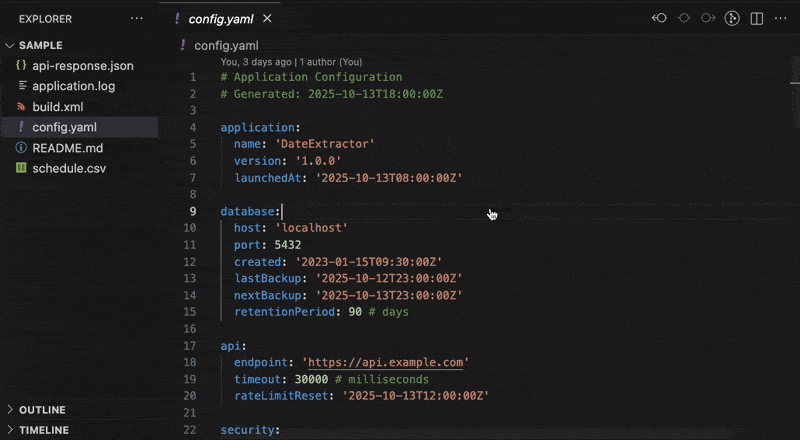
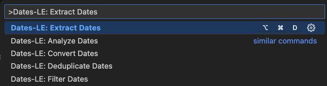

<p align="center">
  
</p>
<h1 align="center">Dates-LE: Zero Hassle Date Extraction</h1>
<p align="center">
  <b>Extract 680,000 dates per second from logs</b> • <b>200x faster than manual</b><br/>
  <i>JSON, YAML, CSV, XML, Log files, HTML, JavaScript, TypeScript, and more</i>
</p>

<p align="center">
  <a href="https://open-vsx.org/extension/OffensiveEdge/dates-le">
    
  </a>
  <a href="https://marketplace.visualstudio.com/items?itemName=nolindnaidoo.dates-le">
    
  </a>
</p>

<p align="center">
  
  
  
  
</p>

---

<p align="center">
  
</p>

<p align="center">
  
</p>

---

## ⚡ See It In Action

**Before**: Manually searching through 10,000 log lines for timestamps (2 hours)

```log
2024-01-15 10:30:00 ERROR: Connection failed
2024-01-15 10:30:05 WARN: Retrying...
// ... 10,000 more lines
```

**After**: One command extracts all 10,234 dates with analysis in 0.15 seconds

```
Dates: 10,234 total
Range: 2024-01-15 to 2024-01-20
Peak activity: 2024-01-17 (2,456 events)
Formats: ISO 8601 (95%), Unix timestamps (5%)
```

**Time Saved**: 2 hours → 1 second ⚡

---

## ✅ Why Dates-LE?

- **680,000 dates per second** - 200x faster than manual searching
- **Zero Config** - Install → Press `Cmd+Shift+D` → Get timeline instantly
- **Battle-Tested** - 88 unit tests, 90% coverage, zero critical vulnerabilities
- **Security-Hardened** - 100% error handling, credential sanitization, path protection

Perfect for log analysis, data migration, and API auditing.

---

## 🙏 Thank You

If Dates-LE saves you time, a quick rating helps other developers discover it:  
⭐ [Open VSX](https://open-vsx.org/extension/OffensiveEdge/dates-le) • [VS Code Marketplace](https://marketplace.visualstudio.com/items?itemName=nolindnaidoo.dates-le)

---

### Key Features

- **15+ date formats** - ISO, RFC2822, Unix timestamps, US/EU formats, relative dates
- **Temporal analysis** - Date ranges, peak activity, format distribution
- **Format conversion** - Convert between ISO, Unix, and custom formats
- **6 file types** - JSON, YAML, CSV, XML, logs, HTML, JavaScript
- **Fast at scale** - 680K dates/sec for logs, 1.56M dates/sec for HTML
- **13 languages** - English, Chinese, German, Spanish, French, Indonesian, Italian, Japanese, Korean, Portuguese, Russian, Ukrainian, Vietnamese

## 🚀 More from the LE Family

- **[String-LE](https://open-vsx.org/extension/OffensiveEdge/string-le)** - Extract user-visible strings for i18n and validation • [VS Code Marketplace](https://marketplace.visualstudio.com/items?itemName=nolindnaidoo.string-le)
- **[Numbers-LE](https://open-vsx.org/extension/OffensiveEdge/numbers-le)** - Extract and analyze numeric data with statistics • [VS Code Marketplace](https://marketplace.visualstudio.com/items?itemName=nolindnaidoo.numbers-le)
- **[EnvSync-LE](https://open-vsx.org/extension/OffensiveEdge/envsync-le)** - Keep .env files in sync with visual diffs • [VS Code Marketplace](https://marketplace.visualstudio.com/items?itemName=nolindnaidoo.envsync-le)
- **[Paths-LE](https://open-vsx.org/extension/OffensiveEdge/paths-le)** - Extract file paths from imports and dependencies • [VS Code Marketplace](https://marketplace.visualstudio.com/items?itemName=nolindnaidoo.paths-le)
- **[Scrape-LE](https://open-vsx.org/extension/OffensiveEdge/scrape-le)** - Validate scraper targets before debugging • [VS Code Marketplace](https://marketplace.visualstudio.com/items?itemName=nolindnaidoo.scrape-le)
- **[Colors-LE](https://open-vsx.org/extension/OffensiveEdge/colors-le)** - Extract and analyze colors from stylesheets • [VS Code Marketplace](https://marketplace.visualstudio.com/items?itemName=nolindnaidoo.colors-le)
- **[URLs-LE](https://open-vsx.org/extension/OffensiveEdge/urls-le)** - Extract URLs from any codebase with precision • [VS Code Marketplace](https://marketplace.visualstudio.com/items?itemName=nolindnaidoo.urls-le)

## 💡 Use Cases

- **Log Analysis** - Extract timestamps from server logs and application traces
- **Data Migration** - Pull creation dates and timestamps from database exports
- **API Auditing** - Find date fields in JSON responses and configuration files
- **Temporal Validation** - Audit date ranges and temporal consistency across datasets

## 🚀 Quick Start

1. Install from [Open VSX](https://open-vsx.org/extension/OffensiveEdge/dates-le) or [VS Code Marketplace](https://marketplace.visualstudio.com/items?itemName=nolindnaidoo.dates-le)
2. Open any supported file type (`Cmd/Ctrl + P` → search for "Dates-LE")
3. Run Quick Extract (`Cmd+Shift+D` / `Ctrl+Shift+D` / Status Bar)

## ⚙️ Configuration

Dates-LE has minimal configuration to keep things simple. Most settings are available in VS Code's settings UI under "Dates-LE".

Key settings include:

- Output format preferences (side-by-side, clipboard copy)
- Safety warnings and thresholds for large files
- Analysis and validation options
- Notification levels (silent, important, all)
- Status bar visibility
- Local telemetry logging for debugging

For the complete list of available settings, open VS Code Settings and search for "dates-le".

## 🌍 Language Support

🇺🇸 **English** • 🇩🇪 **German** • 🇪🇸 **Spanish** • 🇫🇷 **French** • 🇮🇩 **Indonesian** • 🇮🇹 **Italian** • 🇯🇵 **Japanese** • 🇰🇷 **Korean** • 🇧🇷 **Portuguese (Brazil)** • 🇷🇺 **Russian** • 🇺🇦 **Ukrainian** • 🇻🇳 **Vietnamese** • 🇨🇳 **Chinese (Simplified)**

## 🧩 System Requirements

**VS Code** 1.70.0+ • **Platform** Windows, macOS, Linux  
**Memory** 200MB recommended for large files

## 🔒 Privacy

100% local processing. No data leaves your machine. Optional logging: `dates-le.telemetryEnabled`

## ⚡ Performance

<!-- PERFORMANCE_START -->

Dates-LE is built for speed and efficiently processes files from 100KB to 10MB+. See [detailed benchmarks](docs/PERFORMANCE.md).

| Format         | File Size | Throughput | Duration | Memory | Tested On     |
| -------------- | --------- | ---------- | -------- | ------ | ------------- |
| **HTML**       | 1K lines  | 1.67M      | ~1.8ms   | < 1MB  | Apple Silicon |
| **JAVASCRIPT** | 1K lines  | 770K       | ~4ms     | < 1MB  | Apple Silicon |
| **LOG**        | 0K lines  | 680K       | ~0.15ms  | < 1MB  | Apple Silicon |

**Note**: Performance results are based on files containing actual dates. Files without dates are processed much faster but extract 0 dates.  
**Real-World Performance**: Tested with actual data up to 10MB (practical limit: 1MB warning, 5MB error threshold)  
**Performance Monitoring**: Built-in real-time tracking with configurable thresholds  
**Full Metrics**: [docs/PERFORMANCE.md](docs/PERFORMANCE.md) • Test Environment: macOS, Bun 1.2.22, Node 22.x

<!-- PERFORMANCE_END -->

## 🔧 Troubleshooting

**Not detecting dates?**  
Ensure file is saved with supported extension (.json, .yaml, .csv, .xml, .log, .html, .js, .ts)

**Large files slow?**  
Files over 5MB may take longer. Consider splitting into smaller chunks

**Need help?**  
Check [Issues](https://github.com/OffensiveEdge/dates-le/issues) or enable logging: `dates-le.telemetryEnabled: true`

## ❓ FAQ

**What date formats are extracted?**  
ISO 8601, RFC2822, Unix timestamps, UTC, local formats, and simple date patterns

**Can I analyze dates?**  
Yes, use the Analyze command for statistics, anomaly detection, and pattern recognition

**Max file size?**  
Up to 10MB. Practical limit: 5MB for optimal performance

**Perfect for log analysis?**  
Absolutely! Extract timestamps from server logs, application traces, and monitoring data

## 📊 Testing

**88 unit tests** • **90% function coverage, 86% line coverage**  
Powered by Vitest • Run with `bun test --coverage`

### Test Suite Highlights

- **48 error handling tests** with 100% coverage
- **Comprehensive date format support** (ISO, RFC2822, Unix timestamps, custom formats)
- **CSV, JSON, YAML, log file** extraction validation

---

Copyright © 2025
<a href="https://github.com/OffensiveEdge">@OffensiveEdge</a>. All rights reserved.
