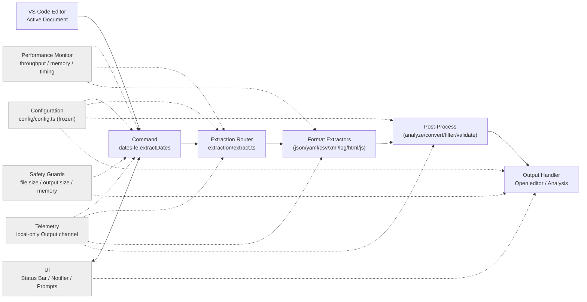
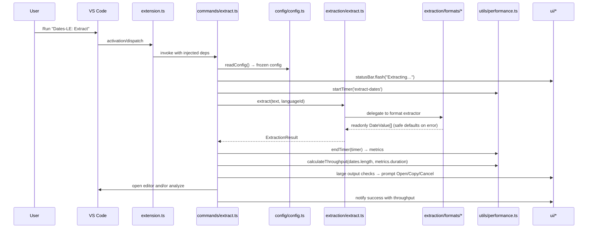
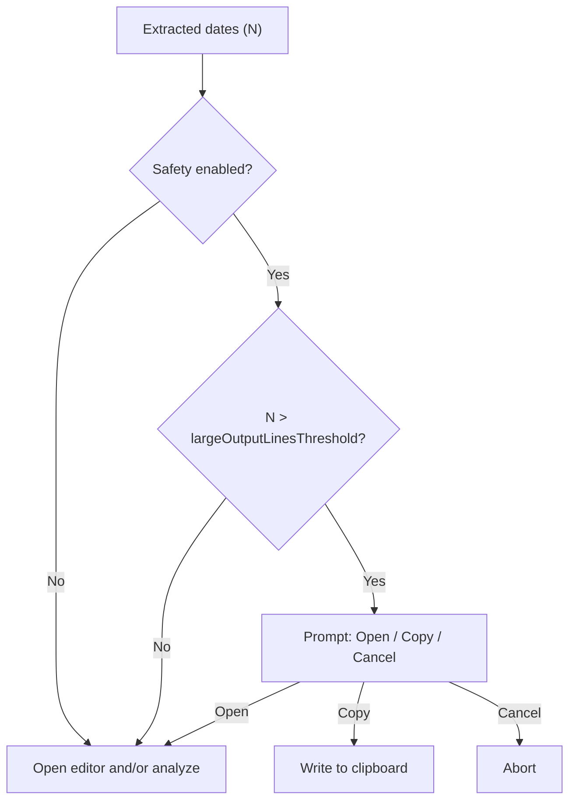
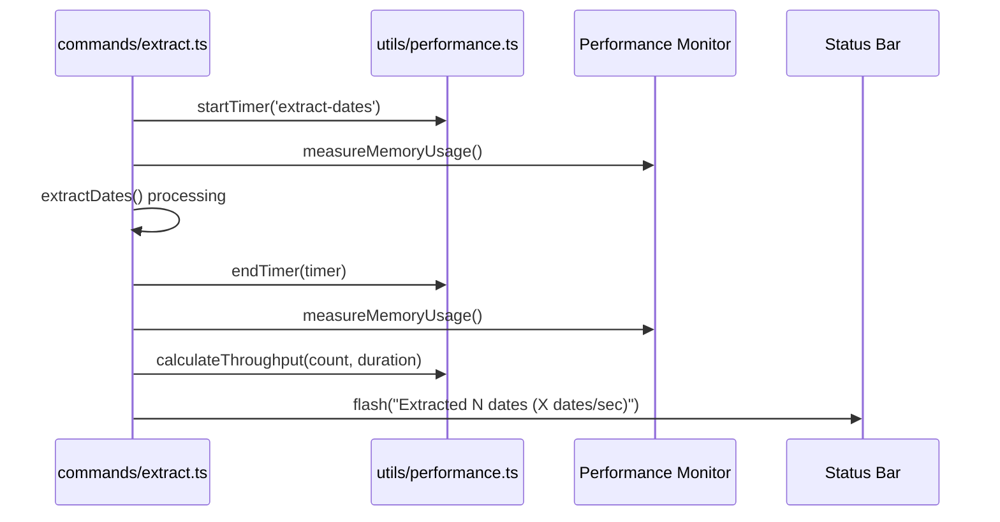

# Dates-LE Architecture

Technical architecture, design patterns, and module boundaries for production-grade date extraction at scale.

## Core Structure

```
src/
├── extension.ts          # Minimal activation - registers commands/providers only
├── types.ts             # Core type definitions and interfaces
├── commands/            # Command implementations with dependency injection
│   ├── index.ts         # Centralized command registration
│   ├── extract.ts       # Main extraction command
│   ├── analyze.ts       # Statistical analysis command
│   ├── convert.ts       # Date conversion command
│   ├── filter.ts        # Date filtering command
│   └── validate.ts      # Date validation command
├── extraction/          # Date extraction engine
│   ├── extract.ts       # Router pattern - delegates to format handlers
│   ├── formats/         # Format-specific extractors
│   │   ├── json.ts      # JSON parser with error handling
│   │   ├── yaml.ts      # YAML parser
│   │   ├── csv.ts       # CSV parser with streaming support
│   │   ├── xml.ts       # XML parser
│   │   ├── log.ts       # Log file parser
│   │   ├── html.ts      # HTML parser
│   │   └── javascript.ts # JavaScript/TypeScript parser
│   └── performance.bench.ts # Performance benchmarking
├── analysis/            # Statistical analysis engine
│   └── statistics.ts    # Date statistics and anomaly detection
├── conversion/          # Date conversion utilities
│   └── dateConverter.ts # Format conversion and timezone handling
├── config/              # Configuration management
│   ├── config.ts        # Main config reader with frozen objects
│   └── settings.ts      # VS Code settings command registration
├── ui/                  # User interface components
│   ├── statusBar.ts     # Status bar factory with flash messaging
│   ├── notifier.ts      # Notification abstraction
│   └── prompts.ts       # User input prompts
├── utils/               # Pure utility functions
│   ├── errorHandling.ts # Error handling and logging
│   ├── localization.ts  # Internationalization support
│   ├── performance.ts   # Performance monitoring
│   ├── progress.ts      # Progress tracking
│   ├── safety.ts        # Safety checks and validation
│   └── sort.ts          # Date sorting utilities
├── services/            # Service layer
│   └── serviceFactory.ts # Service factory with dependency injection
└── telemetry/           # Local-only logging
    └── telemetry.ts     # Output channel factory
```

## Runtime Flow



Key properties:

- Configuration is read once per action and exposed as immutable objects
- Errors never throw from extractors; safe defaults are returned
- Safety prompts offer Open / Copy / Cancel for large outputs
- Statistical analysis is opt-in via configuration
- Performance monitoring tracks throughput and memory usage

## Module Boundaries and Dependencies

```mermaid
graph TD
  subgraph VSCode["VS Code API"]
    vscode[vscode]
  end

  subgraph Ext["Extension Shell"]
    ext[src/extension.ts]
  end

  subgraph Cmds["Commands"]
    cmdIndex[src/commands/index.ts]
    cmdExtract[src/commands/extract.ts]
    cmdAnalyze[src/commands/analyze.ts]
    cmdConvert[src/commands/convert.ts]
    cmdFilter[src/commands/filter.ts]
    cmdValidate[src/commands/validate.ts]
  end

  subgraph Extract["Extraction Engine"]
    exRouter[src/extraction/extract.ts]
    exFormats[src/extraction/formats/*]
  end

  subgraph Analysis["Analysis Engine"]
    analysis[src/analysis/statistics.ts]
  end

  subgraph Conversion["Conversion Engine"]
    conversion[src/conversion/dateConverter.ts]
  end

  subgraph UI["UI Components"]
    uiStatus[src/ui/statusBar.ts]
    uiNotify[src/ui/notifier.ts]
    uiPrompts[src/ui/prompts.ts]
  end

  subgraph Config["Configuration"]
    cfg[src/config/config.ts]
  end

  subgraph Utils["Utilities & Types"]
    utilError[src/utils/errorHandling.ts]
    utilLocal[src/utils/localization.ts]
    utilPerf[src/utils/performance.ts]
    utilProgress[src/utils/progress.ts]
    utilSafety[src/utils/safety.ts]
    utilSort[src/utils/sort.ts]
    types[src/types.ts]
  end

  subgraph Services["Services"]
    services[src/services/serviceFactory.ts]
  end

  subgraph Telemetry["Telemetry (local-only)"]
    tel[src/telemetry/telemetry.ts]
  end

  ext --> cmdIndex
  cmdIndex --> cmdExtract
  cmdIndex --> cmdAnalyze
  cmdIndex --> cmdConvert
  cmdIndex --> cmdFilter
  cmdIndex --> cmdValidate

  cmdExtract --> exRouter
  cmdExtract --> uiNotify
  cmdExtract --> uiStatus
  cmdExtract --> uiPrompts
  cmdExtract --> cfg
  cmdExtract --> tel
  cmdExtract --> utilPerf

  cmdAnalyze --> analysis
  cmdConvert --> conversion
  cmdFilter --> utilSort
  cmdValidate --> utilSafety

  exRouter --> exFormats

  services --> utilError
  services --> utilLocal
  services --> utilPerf

  cfg --> types

  ext --> vscode
  cmdIndex --> vscode
  UI --> vscode
```



Conventions:

- All factory outputs are immutable; data structures use `readonly` and `Object.freeze()`
- Dependency injection is used for commands; `src/extension.ts` stays thin
- Modules prefer pure functions with explicit return types

---

## Architectural Principles

- **Minimal activation**: `src/extension.ts` wires dependencies and registers disposables only
- **Pure core**: extraction, utilities, and analysis are pure functions with explicit return types
- **Immutable data**: config and results are frozen; no in-place mutations
- **Safety first**: guard rails for file size, output size, and memory usage
- **Progressive disclosure**: subtle status bar feedback; prompts only when needed
- **Performance by design**: streaming support for large datasets, efficient algorithms

## Design Rationale

### Why Functional Over OOP

**Decision**: Use factory functions and pure functions rather than classes.

**Rationale**:

- Immutability guarantees via `Object.freeze()` prevent entire classes of bugs
- Pure functions are trivially testable without complex mock hierarchies
- No hidden state or side effects; all dependencies are explicit
- Smaller bundle size (no class overhead)
- Better tree-shaking in bundlers

**Trade-off**: Slightly more verbose dependency passing, but gains in testability and reliability far outweigh this cost.

### Router Pattern for Format Extraction

**Decision**: Single entry point (`extract.ts`) delegates to format-specific modules.

**Rationale**:

- Format-specific logic is isolated and independently testable
- Adding new formats requires no changes to existing extractors
- Error handling is centralized with consistent behavior
- Easy to disable or modify specific format support

**Trade-off**: Extra indirection layer, but the modularity and maintainability justify it.

### Performance Monitoring Integration

**Decision**: Integrate performance monitoring directly into extraction pipeline.

**Rationale**:

- Real-time throughput and memory usage tracking
- Automatic performance regression detection
- User feedback on processing speed
- Benchmarking capabilities for optimization

**Trade-off**: Slight overhead from monitoring, but essential for production performance.

### Performance Monitoring Classes

**Decision**: Use classes for `PerformanceMonitor` and `PerformanceTracker` instead of factory functions.

**Rationale**:

- Stateful performance tracking requires encapsulated mutable state (timers, metrics)
- Class lifecycle methods (`startTimer`/`endTimer`) provide clearer semantics than closures
- Internal state mutations are intentionally hidden from consumers
- Created via factory function `createPerformanceMonitor()` to maintain consistency with codebase patterns

**Scope**: Limited to performance utilities only. All other services use factory functions.

**Trade-off**: Deviation from pure functional pattern, but classes provide better encapsulation for this specific use case.

## Component Responsibilities

- **`commands/*`**: Orchestrate user interactions, read config, call core functions, present results
- **`extraction/*`**: Parse input and return `readonly DateValue[]` with safe defaults
- **`analysis/*`**: Statistical analysis, anomaly detection, pattern recognition
- **`conversion/*`**: Date format conversion, timezone handling, formatting
- **`ui/*`**: Present status, notifications, prompts for user feedback
- **`config/config.ts`**: Read, validate, freeze, and expose settings
- **`utils/*`**: Side-effect free helpers (error handling, performance, validation)
- **`services/*`**: Service factory with dependency injection
- **`telemetry/telemetry.ts`**: Local-only Output channel logging

### Public Interfaces

```ts
export type DateValue = Readonly<{
  value: string
  format: DateFormat
  timestamp: number
  position?: Readonly<{ line: number; column: number }>
  context: string
}>

export type ExtractionResult = Readonly<{
  success: boolean
  dates: readonly DateValue[]
  errors: readonly ParseError[]
}>

export type DateStatistics = Readonly<{
  total: number
  unique: number
  duplicates: number
  range?: Readonly<{ start: Date; end: Date; duration: number }>
  average?: number
  median?: number
  anomalies: readonly DateAnomaly[]
  patterns: readonly DatePattern[]
  clusters: readonly DateCluster[]
  gaps: readonly DateGap[]
}>

export type DateConversionOptions = Readonly<{
  targetFormat: DateFormat
  timezone?: string
  locale?: string
  customFormat?: string
}>

export type DateFilterOptions = Readonly<{
  dateRange?: Readonly<{ start: Date; end: Date }>
  formats?: readonly DateFormat[]
  excludeFormats?: readonly DateFormat[]
  removeDuplicates?: boolean
  removeInvalid?: boolean
  excludeFuture?: boolean
  excludePast?: boolean
}>

export type DateValidationOptions = Readonly<{
  rules: readonly DateValidationRule[]
  severity: 'error' | 'warning' | 'info'
}>
```

## Sequence: Extract Command



## Dependency Injection Contracts

```ts
export function registerCommands(
  context: vscode.ExtensionContext,
  deps: Readonly<{
    telemetry: Telemetry
    notifier: Notifier
    statusBar: StatusBar
    performanceMonitor: PerformanceMonitor
  }>,
): void
```

Guidelines:

- Construct UI and telemetry factories at activation; pass to command registrars
- Keep all state within function scope or minimal module closures; avoid globals

## Cross-Cutting Concerns

- **Localization**: Manifest strings in `package.nls*.json`; runtime via `vscode-nls`
- **Telemetry**: Local-only; off by default; outputs to Output panel
- **Safety**: Thresholds and prompts central to UX; never block without an option to proceed
- **Cancellation**: Use `withProgress` and cancellation tokens for long operations
- **Performance**: Real-time monitoring with throughput and memory tracking

## Extensibility Playbooks

- **Add extractor**: Implement format-specific extractor, register in router, add tests
- **Add command**: Create factory in `commands/`, declare in `package.json`, wire registration
- **Add setting**: Update `package.json` contributes, read/validate in config, consume in logic
- **Add analysis metric**: Extend `DateStatistics`, implement in `analysis/statistics.ts`, add tests
- **Add conversion format**: Extend `DateFormat`, implement in `conversion/dateConverter.ts`

## Performance Budgets

- Small files (<100KB) end-to-end under ~100ms common path
- Large files (1-10MB) under 2 seconds with streaming
- Memory usage capped at 500MB with safety warnings
- Statistical analysis adds <30% processing time
- Performance monitoring overhead <5% of processing time

## Security & Privacy

- No network calls; all processing is local
- Respect workspace trust and virtual workspace limitations
- Validate user inputs and file operations
- Sanitize prompts to prevent injection attacks

## Safety & UX Decision Flow



## Performance Monitoring Pipeline



---

**Project:** [Issues](https://github.com/OffensiveEdge/dates-le/issues) • [Pull Requests](https://github.com/OffensiveEdge/dates-le/pulls) • [Releases](https://github.com/OffensiveEdge/dates-le/releases)

**Docs:** [Architecture](ARCHITECTURE.md) • [Performance](PERFORMANCE.md) • [I18N](I18N.md) • [Governance](governance/)
